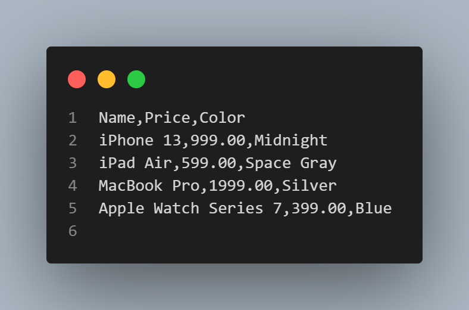
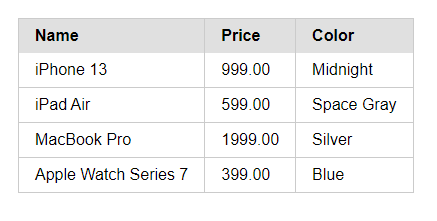

# Goal

Read CSV, TSV, JSON files into a HTML Table in the browser.

1. It will read the file
2. Create a Html table in memory
3. Start a webserver on localhost:8000
4. Open the browser
5. Display the Html Table in the browser

# Examples

## Csv Example
CSV file:

Output Html Table in Browser:

# TODO
- JSON
- TSV
- Seperator selector

Notes:
- Table to markdown:
- https://gist.github.com/styfle/c4bba2d29e6cb9b585de72207c006af7
- Json to markdown
- https://2freeclear.wordpress.com/2014/08/09/create-nested-html-tables-from-complex-json/
- https://gridjs.io/
